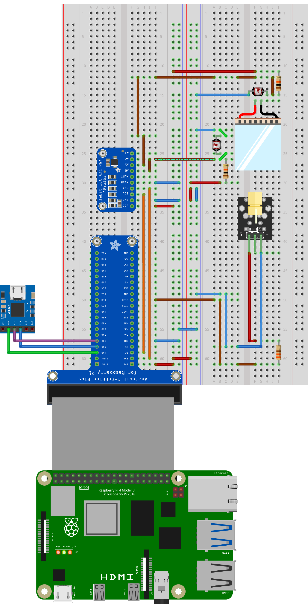
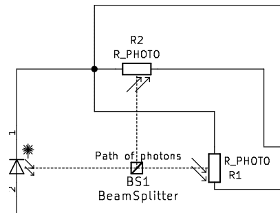
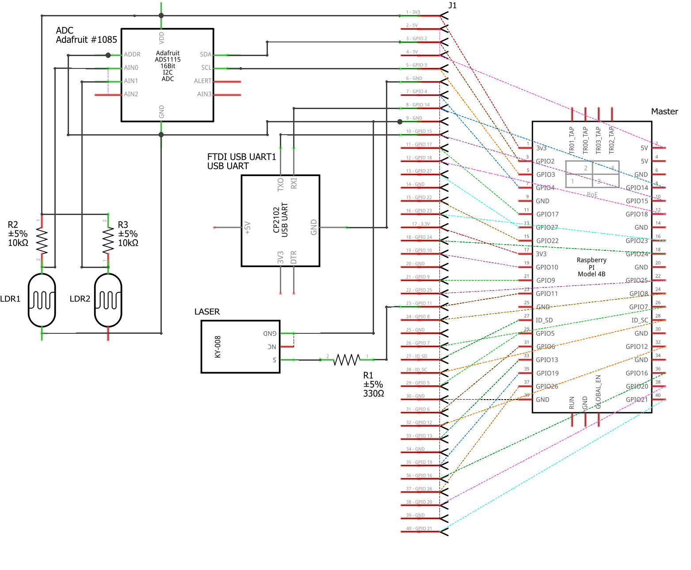

# A baremetal Quantum Random Bit Generator

This repository contains the description of an Embedded Systems project realized for the Master’s Degree Course in Computer Engineering at the University of Palermo. The project focuses on the design and implementation of a Quantum Random Bit Generator (QRBG) controlled by a single-board controller that is interfaced in bare-metal mode through Forth, a lightweight, stack-based, intermediate-level language that provides an efficient management for both computational and communication tasks.

## Table of Contents

- [A baremetal Quantum Random Bit Generator](#a-baremetal-quantum-random-bit-generation)
  - [Table of Contents](#table-of-contents)
  - [Abstract](#abstract)
  - [Quantum Bit Generation](#quantum-bit-generation)
  - [Tools](#quantum-bit-generation)
  - [Configuration](#preview)
  - [Tests](#tests)
  - [Code Navigation](#code-navigation)

## Abstract

The project focuses on the design and implementation of a Quantum Random Bit Generator (QRBG) controlled by a single-board controller that is interfaced in bare-metal mode through Forth, a lightweight, stack-based intermediate-level language that provides an efficient management for both computational and communication tasks.

Random bit generation is the process of producing bits that exhibit no discernible pattern or predictability, thereby appearing random. These bits are crucial for a wide array of applications across various domains, including cryptography, simulation, gaming, and secure communication protocols. Traditional methods of random bit generation, such as pseudo-random number generators (PRNGs), rely on deterministic algorithms to produce sequences of numbers that approximate randomness. However, these sequences are ultimately predictable, which can pose security risks in certain applications.

With the recent advent of Quantum Technologies, which, among all of the other things, promise to achieve such significant computational speed-ups so as to render classical, brute-force resistant cryptography obsolete, concerns arise for the security of communications. On the flipside, those very same technologies that pose a threat to the integrity of the users’ data, can be exploited to design and build mechanisms that are resistant to those point of attack.

Out of the different hardware technologies that implement the quantum paradigm, the optical/photonic one is the alternative that, due to its robustness and ease of implementation, appears to be most suitable for dealing with the exchange of information between two or more parties. It is upon those consideration that this project achieves Random Bit Generation through the realization of a laser-based physical qubit, the information unit of quantum computation, along with the (classical) embedded system that is required to control it.

Tests on the randomness of this toy system showcase the maximal entropy of the integrated half-interferometer system, proving the validity

## Quantum Bit Generation

On the breadboard, an half-interferometer configuration is built, where a Laser Diode is activated to shine a ray of photons towards a Beam Splitter prism, which routes the beam towards two Light-Dependent Resistors. When exiting the LD, the quantum nature of the photons is such that they are all in superposition of states, the states being the two main polarization directions (horizontalvertical) of the light wave. Then, the voltages on each of those resistors are read, causing the wavefunction of the polarization states to collapse into one of the two directions, and a bit is generated according to which LDR receives more photons, corresponding to the preferential polarization direction chosen by the photons at measurement. This setup, similar to that used in __[this project](https://github.com/Spooky-Manufacturing/QRNG)__ by __[Spooky Manufacturing](https://github.com/Spooky-Manufacturing/QRNG)__, is displayed in the Figure below.

## Tools

The Hardware tools used to implement the baremetal QRBG are listed below:

 * Raspberry Pi 4B as main controller
 * CP2102 USB-to-TTL module for UART communication
 * 650nm, 5mW Laser Diode as photon sorce
 * 50/50 Beam Splitter prism to deviate the laser beam
 * 2 Light-Dependent Resistors for readout
 * Adafruit ADS1115 ADC module to digitalize the LDR analog inputs
 * Breadboard, T-Cobbler extension and Jumper Wires for connections

Software tools are instead as follows:

 * ZOC8 as terminal interface between the development machine and main controller
 * pijFORTHos as baremetal FORTH interpreter for the Raspberry Pi
 * FORTH language to program the controller on hardware level

## Configuration

The components introduced in the previous section are placed in the physical configuration displayed in the initial Figure, while the circuit connections are explicited in the figure below. The flow of information starts at the bottom of the picture and proceeds counter-clockwise through it:
 1. the controlling Forth code is first uploaded to the main controller through the CP2102 module with the UART protocol;
 2. the Raspberry GPIOs are connected to the breadboard through a T-Cobbler extension, providing both power supply and data interface to the rest of the circuit;
 3. as a first operation, the Laser is activated through GPIO Pin 11 configured in output mode and its supply is regulated by a 330 Ω resistor;
 4. the generated beam of photons incides onto the 50/50 Beam Splitter which divides it into two main direction, a straight and a 90 degrees one;
 5. the two separated beams land onto a photoresistor each; those LDRs are configured in a voltage divider with a 10 kΩ resistance, and the middle node is directly connected to one of the analog inputs on the ADS1115 ADC;
6. as a last step, the controller makes sure that an updated digital conversion value is ready and then initiates an I2C read operation from the ADC slave.

## Synchronization

In an ideal scenario, the Random Bit Generation can occur at really high speeds, enhancing the performance of its communication security applications. 

While the model developed in this work is theoretically optimal in terms of computational time, in the sense that it is just as fast as the main controller processor, in practice, the whole system has one significant bottleneck: the sample rate of the ADC. The chosen ADS1115 module, despite being a pretty good working device, especially in relation to its cost, is definitely not the fastest one available, with a top 860 SPS speed, which of course is much lower than the 1.5 GHz clock speed of the main controller. 

For this reason, being that, in the end, the overall bit generation is indeed paced by the ADC, there is no need of continuously polling the ADC for new conversion results when we are sure that a new one has not yet occurred. In the resource-efficiency-oriented philosophy of Embedded Systems, unnecessary processor load can be relieved if ADC-read actions are appropriately timed. This is achieved by exploiting the System Timer of the BCM2711.

## Tests

Having defined the entire architecture, and having also assessed its computational performance, we are left with the evaluation of the quality of randomness of generated bits. Here, with the term ”quality”, we refer to the desired feature of uniformity of probability distribution, as well as unpredictability of sequences. 

To benchmark those aspects, multiple runs of the bit generation process have been executed under a fixed hardware environment (i.e., as it can be imagined, a precise physical distance must be set between the Beam Splitter and the LDRs, in order to match the overall intensity of the light inciding on the sensors), then, the output bits dumped to the ZOC8 terminal were exported outside of the main development environment to a Python script to ease the plotting of the gathered data.

The first test, whose output is depicted in the Figure below involves a the simple generation of a random
bit stream to analyze the frequency of 0s and 1s, which we indeed observe being roughly 50/50 split
between the two, as we would expect.

As a second test, 1024 generated bits were grouped 8 at a time, and interpreted as a singlebyte
number. Then, just as before, the frequency of each number was plotted (Figure below), again
displaying a distribution somewhat alike to a uniform one.

## Code Navigation

The Forth code of this repo ("src" subdir) is divided in modules, each corresponding to a different section of the overall implementation. Each module has inside it two files, one with comments (e.g., laser.f) and one without (laser_raw.f), to aid dumping its content onto a terminal interface for testing.

In addition, a separate module named 'merged' contains the commented and uncommented version of all of the linked modules. This way, the project can be consulted by either accessing individual sections, or by reading the entire merged.f file in one go.